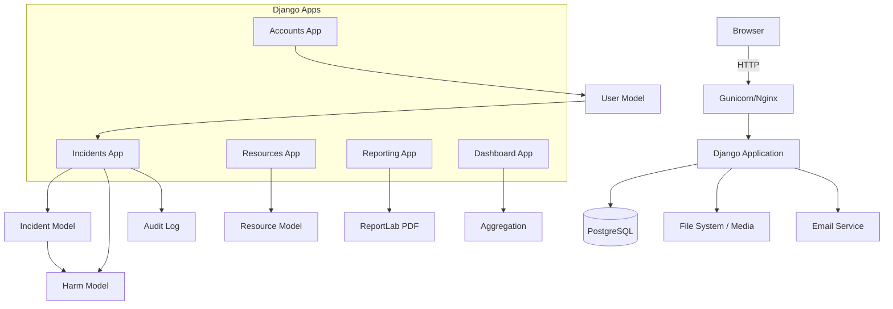
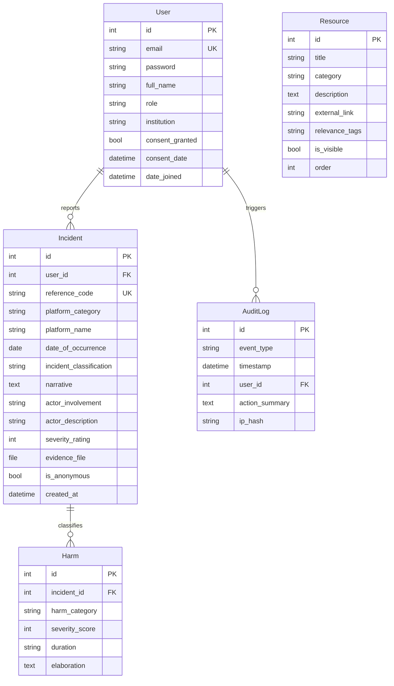

# PrivGuard Architecture

## Component Diagram

## Database Schema

## Security Architecture

- **Authentication:** Django session-based with Argon2 password hashing
- **Session:** 15-minute inactivity timeout, httpOnly + Secure + SameSite Strict cookies
- **CSRF:** Django middleware with httpOnly cookie
- **File Upload:** Type validation (PNG/JPEG/PDF), 5MB max, stored outside web root
- **Audit:** SHA-256 IP hashing, event classification, tamper-evident logging
- **HTTPS:** Enforced via middleware, TLS required in production
