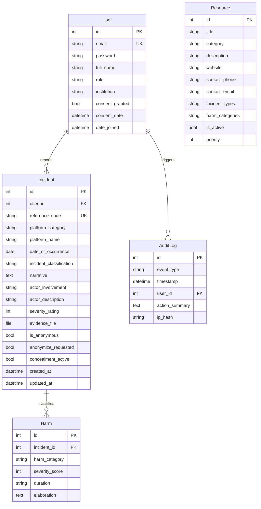
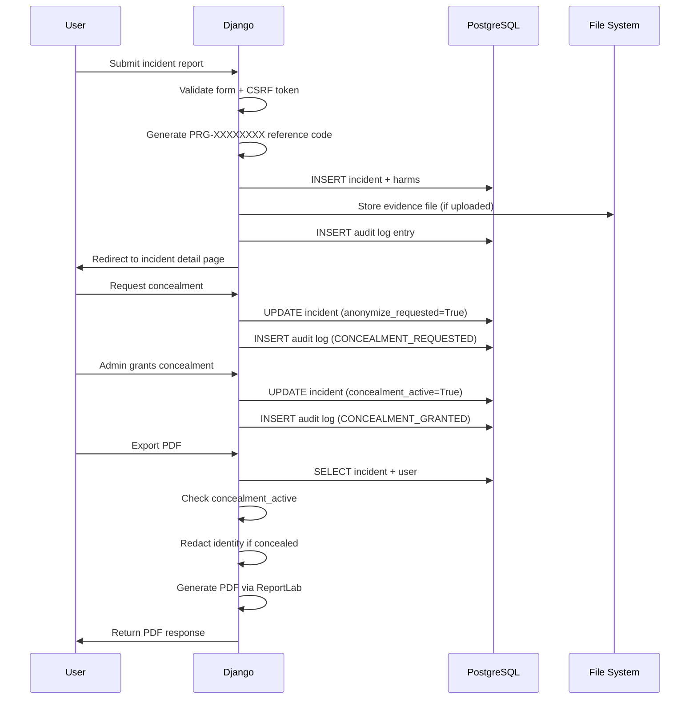

# Architecture

## System Overview

PrivGuard is a server-rendered Django application with PostgreSQL as the database backend. It follows the standard Django MVT (Model-View-Template) pattern with five application modules.

```
┌─────────────────────────────────────────────────────┐
│                     Browser                          │
│  (HTML5 / CSS3 / Vanilla JavaScript)                 │
└─────────────────────┬───────────────────────────────┘
                      │ HTTP
┌─────────────────────▼───────────────────────────────┐
│               Gunicorn / Django Dev Server            │
├─────────┬──────────┬──────────┬──────────┬──────────┤
│accounts │incidents │resources │reporting │dashboard │
│  App    │   App    │   App    │   App    │   App    │
├─────────┴──────────┴──────────┴──────────┴──────────┤
│                  Django ORM                          │
└─────────────────────┬───────────────────────────────┘
                      │
        ┌─────────────▼─────────────┐
        │        PostgreSQL          │
        │   (Neon in production)     │
        └───────────────────────────┘
```

## Application Modules

### `accounts`
- Custom `User` model with email-based authentication
- Role-based access control (student, researcher, admin)
- Consent tracking and anonymization preferences
- Session timeout middleware (15 minutes)

### `incidents`
- Core `Incident` model with 17-field taxonomy
- `Harm` model for multi-dimensional harm classification
- `AuditLog` for security event tracking
- Concealment lifecycle (request → grant/deny → revoke)
- Management commands for synthetic data generation

### `resources`
- `Resource` model with incident-type and harm-category matching
- Smart recommendation engine (`recommended_for()`)
- 27 curated Nigerian organisations

### `reporting`
- PDF generation via ReportLab
- Per-incident identity redaction for concealed reports
- Bulk PDF export with table of contents
- Plain-text fallback on PDF failure

### `dashboard`
- Statistical aggregation (incident counts, harm distributions, severity breakdown)
- Custom template tags for data visualisation

## Database Schema



## Request Flow



## Security Architecture

| Layer | Implementation |
|-------|---------------|
| **Authentication** | Django session-based with Argon2id password hashing |
| **Authorisation** | Role-based decorators (`@admin_required`, `@student_required`) |
| **Session Management** | 15-minute inactivity timeout via custom middleware |
| **CSRF** | Django middleware with `httponly` + `samesite=strict` cookie |
| **Cookies** | `httponly`, `samesite=strict`, configurable `Secure` flag |
| **File Upload** | MIME type validation, 100 KB size limit, stored outside web root |
| **Audit** | SHA-256 IP hashing, 10 event types, tamper-evident logging |
| **Input** | XSS prevention on all user content, parameterised SQL queries |
| **HTTPS** | Configurable via `SECURE_SSL_REDIRECT`, enforced in production |
| **Clickjacking** | `X-Frame-Options: DENY` header |

## Technology Stack

| Component | Technology | Version |
|-----------|-----------|---------|
| Language | Python | 3.10+ |
| Framework | Django | 5.0 |
| Database | PostgreSQL | 14+ |
| ORM | Django ORM | — |
| PDF Engine | ReportLab | 5.0+ |
| Password Hashing | Argon2 (`argon2-cffi`) | 25.1+ |
| Static Files | WhiteNoise | 6.12+ |
| File Upload | UploadThing (cloud) / local fallback | — |
| DB URL Parser | dj-database-url | 3.1+ |
| Environment | python-decouple | 3.8+ |
| WSGI Server | Gunicorn | 26.2+ |
| Container | Docker (multi-stage) | — |
| Serverless | Vercel | — |
